# Widgetkeeper

Extra dashboard widgets for Homey Pro, made to sit naturally next to Homey's own with the same look and feel.

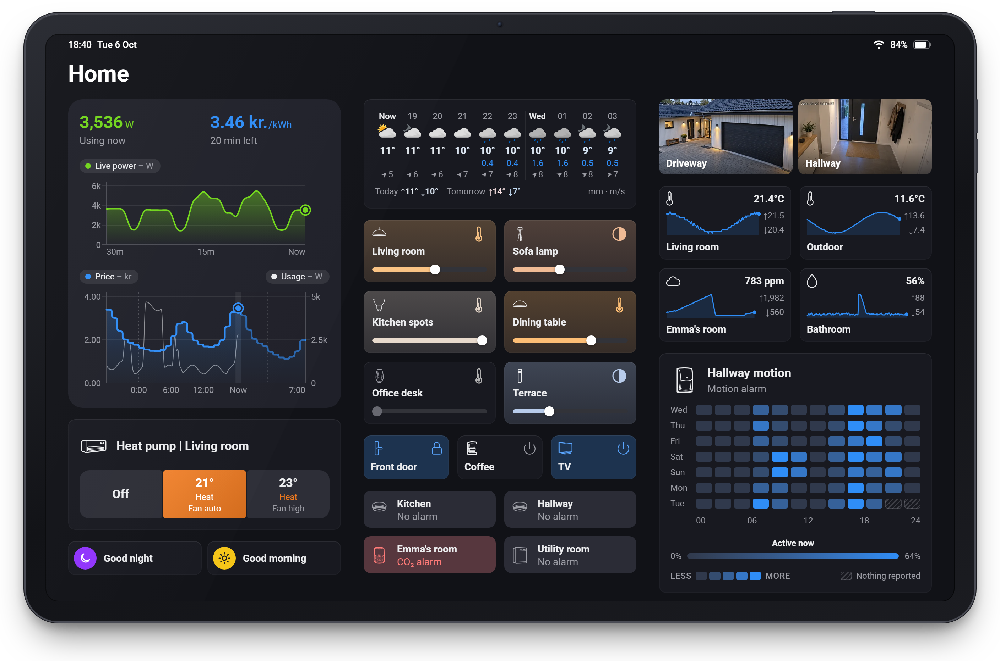

<a href="#electricity-overview"><picture><source media="(prefers-color-scheme: dark)" srcset="docs/previews/electricity-dark.png"></picture></a>
<a href="#electricity-overview"><b>Electricity Overview</b></a> 
Live power use, hourly electricity prices and usage history on one card 

<a href="#thermostat-shortcuts"><picture><source media="(prefers-color-scheme: dark)" srcset="docs/previews/thermostat-dark.png"></picture></a>
<a href="#thermostat-shortcuts"><b>Thermostat Shortcuts</b></a> 
Three one-tap presets for a thermostat, heat pump or air conditioner 

<a href="#device-quick-actions"><picture><source media="(prefers-color-scheme: dark)" srcset="docs/previews/quickactions-dark.png"></picture></a>
<a href="#device-quick-actions"><b>Device Quick Actions</b></a> 
Compact tiles that run a device's quick action with one tap 

<a href="#sensor-alarms"><picture><source media="(prefers-color-scheme: dark)" srcset="docs/previews/sensoralarms-dark.png"></picture></a>
<a href="#sensor-alarms"><b>Sensor Alarms</b></a> 
Tiles that show a sensor's alarm and turn red when one is on 

<a href="#sensor-dots"><picture><source media="(prefers-color-scheme: dark)" srcset="docs/previews/sensordots-dark.png">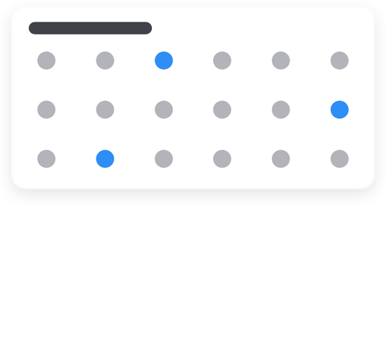</picture></a>
<a href="#sensor-dots"><b>Sensor Dots</b></a> 
Many motion and contact sensors at a glance, as dots that change colour when active 

<a href="#weather-forecast"><picture><source media="(prefers-color-scheme: dark)" srcset="docs/previews/weather-dark.png"></picture></a>
<a href="#weather-forecast"><b>Weather Forecast</b></a> 
The next 36 hours, hour by hour, from MET Norway (yr.no) 

<a href="#insights-heatmap"><picture><source media="(prefers-color-scheme: dark)" srcset="docs/previews/heatmap-dark.png"></picture></a>
<a href="#insights-heatmap"><b>Insights Heatmap</b></a> 
A week of one value (light, temperature, motion …) as a grid of weekdays and hours 

<a href="#cameras"><picture><source media="(prefers-color-scheme: dark)" srcset="docs/previews/cameras-dark.png"></picture></a>
<a href="#cameras"><b>Cameras</b></a> 
Two to six cameras in one grid of snapshots; tap one to watch it live 

<a href="#device-values"><picture><source media="(prefers-color-scheme: dark)" srcset="docs/previews/values-dark.png">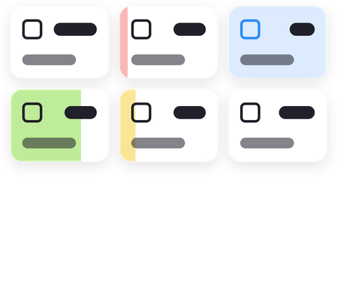</picture></a>
<a href="#device-values"><b>Device Values</b></a> 
Compact tiles that each show one value, such as a temperature, power or on/off 

<a href="#light-controls"><picture><source media="(prefers-color-scheme: dark)" srcset="docs/previews/lights-dark.png">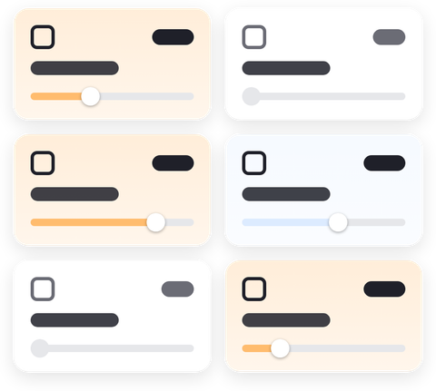</picture></a>
<a href="#light-controls"><b>Light Controls</b></a> 
Compact light tiles with brightness, colour and colour temperature: six lights in the space of three 

<a href="#sparklines"><picture><source media="(prefers-color-scheme: dark)" srcset="docs/previews/sparklines-dark.png">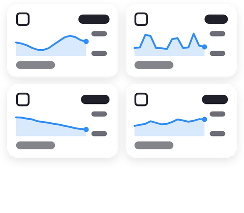</picture></a>
<a href="#sparklines"><b>Sparklines</b></a> 
Tiles with a small chart of a value over the last hour, day or week, with its lowest and highest 

<a href="#flow-variables"><picture><source media="(prefers-color-scheme: dark)" srcset="docs/previews/variables-dark.png">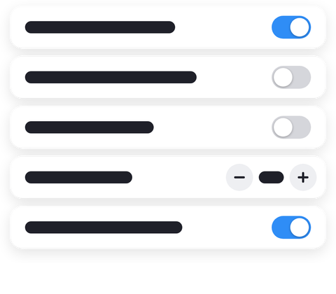</picture></a>
<a href="#flow-variables"><b>Flow Variables</b></a> 
Compact rows to switch flow variables on and off or change a number or text, with the full name 

<a href="#flow-buttons"><picture><source media="(prefers-color-scheme: dark)" srcset="docs/previews/flows-dark.png">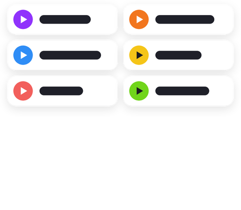</picture></a>
<a href="#flow-buttons"><b>Flow Buttons</b></a> 
Start flows with one tap: a round button in the colour and icon you pick, with the flow's name 

<a href="#price-badge"><picture><source media="(prefers-color-scheme: dark)" srcset="docs/previews/price-dark.png">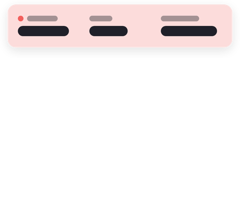</picture></a>
<a href="#price-badge"><b>Price Badge</b></a> 
The electricity price now and the coming hours as small bars, green, yellow or red 

<a href="#timers"><picture><source media="(prefers-color-scheme: dark)" srcset="docs/previews/timers-dark.png">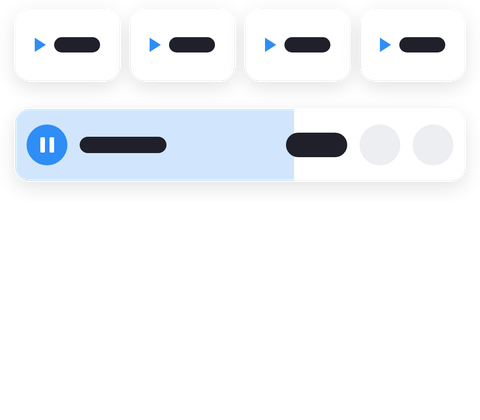</picture></a>
<a href="#timers"><b>Timers</b></a> 
Kitchen timers from one-tap presets, with a Flow card when one runs out 

<a href="#locks-and-doors"><picture><source media="(prefers-color-scheme: dark)" srcset="docs/previews/locks-dark.png">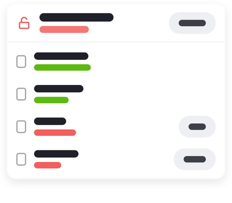</picture></a>
<a href="#locks-and-doors"><b>Locks and Doors</b></a> 
One line that says whether every lock and door is locked and closed 

<a href="#curtains"><picture><source media="(prefers-color-scheme: dark)" srcset="docs/previews/curtains-dark.png">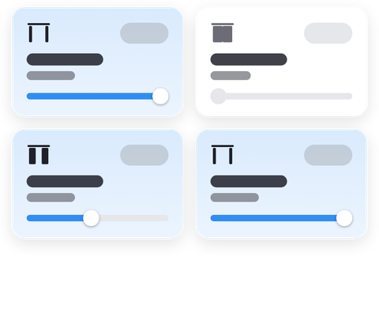</picture></a>
<a href="#curtains"><b>Curtains</b></a> 
Curtains and blinds that open or close with one tap, with a slider for anything in between 

<a href="#media"><picture><source media="(prefers-color-scheme: dark)" srcset="docs/previews/media-dark.png">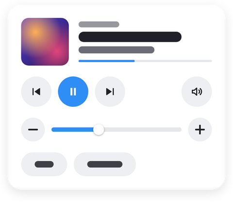</picture></a>
<a href="#media"><b>Media</b></a> 
A speaker with its album art, mute, a volume that never overshoots and buttons for its sources 

<a href="#smart-stack"><picture><source media="(prefers-color-scheme: dark)" srcset="docs/previews/stack-dark.png">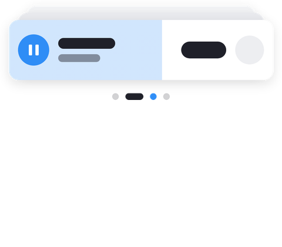</picture></a>
<a href="#smart-stack"><b>Smart Stack</b></a> 
Several widgets in one spot, one at a time, with the one that matters brought forward 

## Electricity Overview

Live power use, the hourly price from yesterday to 12 hours ahead (with your tariffs and taxes from Homey Energy), the last 24 hours of usage and the cheapest hour ahead. Tap a chart to see its values. Works with a fixed price too, and shows solar export below zero.

**Settings:** power meter, live time span, prices, tariffs and taxes, usage history, smooth lines, lowest price in 12 h / 24 h, compact layout.

## Thermostat Shortcuts

Three one-tap presets for a thermostat, heat pump or air conditioner, such as *Off*, *Heat 21°* and *Heat 24° · Fan level 5*. The matching preset lights up.

**Settings:** the device, compact layout, and per button: power, mode, temperature and one extra option such as the fan speed.

## Device Quick Actions

Half-height tiles that run a device's quick action with one tap (on/off, lock, play/pause, a button), highlighted while it's on.

**Settings:** devices, active style.

## Sensor Alarms

Tiles that show *No alarm*, the alarm that's on or how many, and turn red while one is. Every alarm counts, including apps' own such as radon. Tap a tile for all of its alarms.

**Settings:** sensors, count motion and contact, tile names.

## Sensor Dots
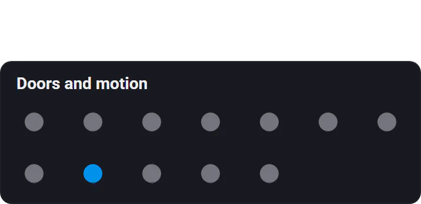

Motion, contact and camera sensors as a grid of dots that light up while active. Tap a dot for its name and since when, such as *Garage · Open since 18:17*.

**Settings:** sensors, title, idle and active colours.

## Weather Forecast

The next 36 hours from [MET Norway](https://www.met.no/en) ([yr.no](https://www.yr.no)), hour by hour, with today's and tomorrow's high and low. Swipe sideways to see further ahead.

**Settings:** compact or detailed, one or two rows, 1–3 hours per column, colour theme.

Weather data from MET Norway, licensed under [CC BY 4.0](https://creativecommons.org/licenses/by/4.0/). Icons: [Yr's weather symbols](https://github.com/metno/weathericons) (MIT).

## Insights Heatmap

A week of one Insights value as a grid of days and hours: numbers such as light or temperature, or how much of each hour a sensor was on.

**Settings:** device and value, this week or the last 3–14 days, hours per column, colour, scale, legend.

## Cameras

Your cameras as a grid of snapshots that refresh every few seconds. Tap one to watch it live.

**Settings:** cameras, refresh interval.

## Device Values
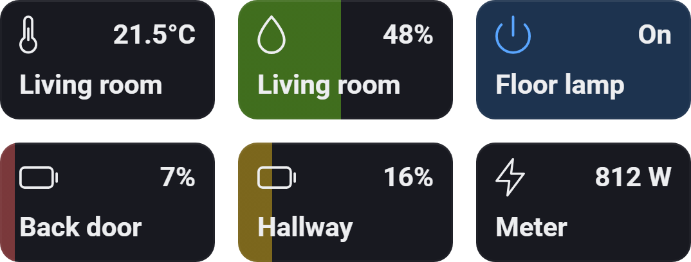

Half-height tiles that each show one live device value. Percentages can fill their tile by level, and the Flow card **Set the tile colour of … to …** colours a tile, such as a fridge going red when it's too warm.

**Settings:** up to six values with optional names, 3 or 2 per row, percentage fill and its limits.

## Light Controls
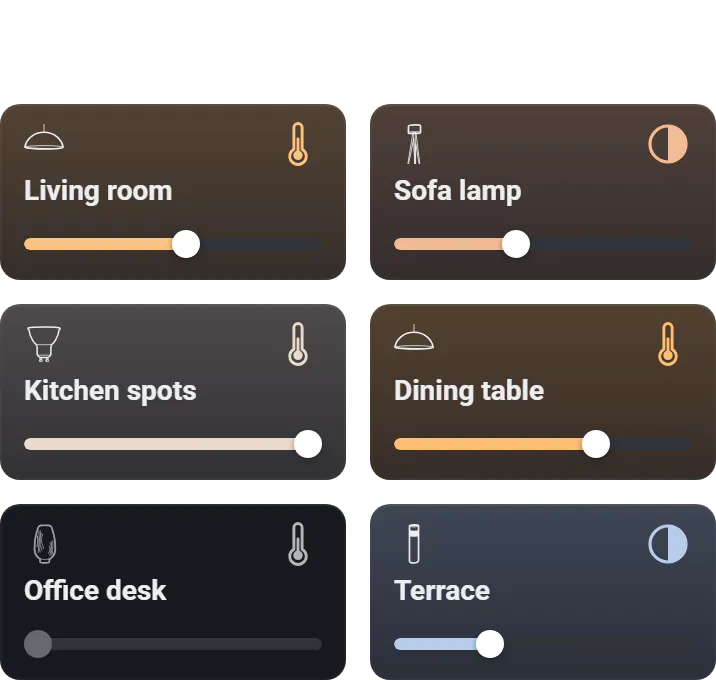

Six lights in the space of three of Homey's light cards. Tap a tile to switch it, drag or tap the bar to dim, and tap the colour button for colours and whites. Lights in a room can share one tile.

**Settings:** lights, group by room, what the bar's far left does, colour palette.

## Sparklines
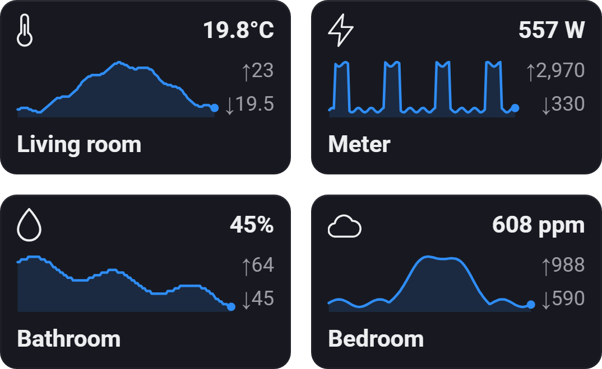

Device Values' tiles with a small live chart of each value and its highest and lowest.

**Settings:** up to six values, time span (1 hour to 7 days), 2 or 1 per row.

## Flow Variables
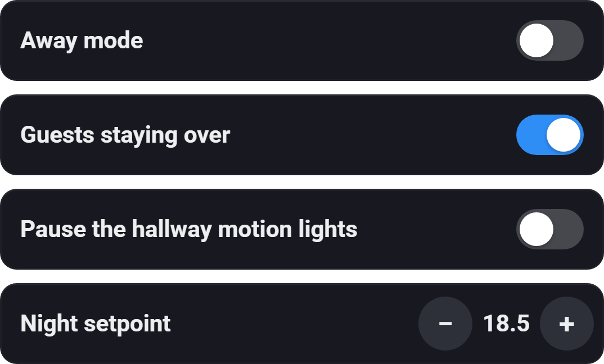

Logic variables as compact rows with their full name: a switch for yes/no, − and + for a number, and the text for a string. Tap a number or text to type a value. Needs an [API key](#api-key) to change them.

**Settings:** up to ten variables with optional names, 1 or 2 columns, the − and + step.

## Flow Buttons
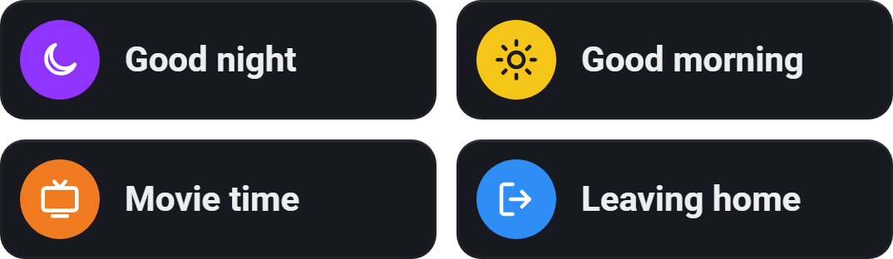

Flows and Advanced Flows as rows with a round button in your colour and icon. Tap a row to start the flow. Needs an [API key](#api-key).

**Settings:** up to eight flows, each with a colour, an icon and an optional name; 1 or 2 columns.

## Price Badge
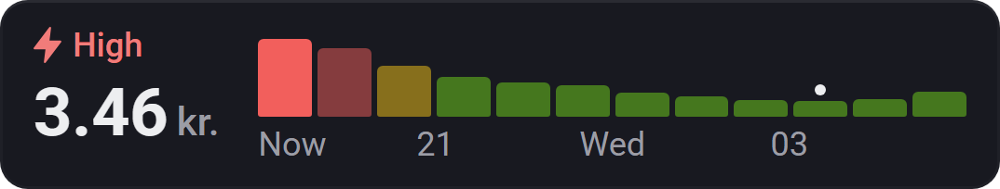

The electricity price now, and the coming 12, 24 or 36 hours as small bars in one tile: green, yellow or red by each hour's level in its day, with a dot over the cheapest. Uses the Electricity Overview's prices and needs no meter.

**Settings:** hours ahead, colour by level, tariffs and taxes.

## Timers
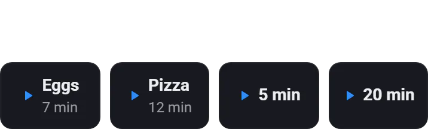

Up to four preset buttons, such as *Eggs · 7 min*. A started timer takes their place: tap to pause, **+1** for a minute more, **✕** to cancel. It beeps and turns red when done. The timer runs on Homey, so every screen sees it and the Flow card **A timer finished** fires with no dashboard open.

**Settings:** four presets with minutes and an optional name, sound.

## Locks and Doors
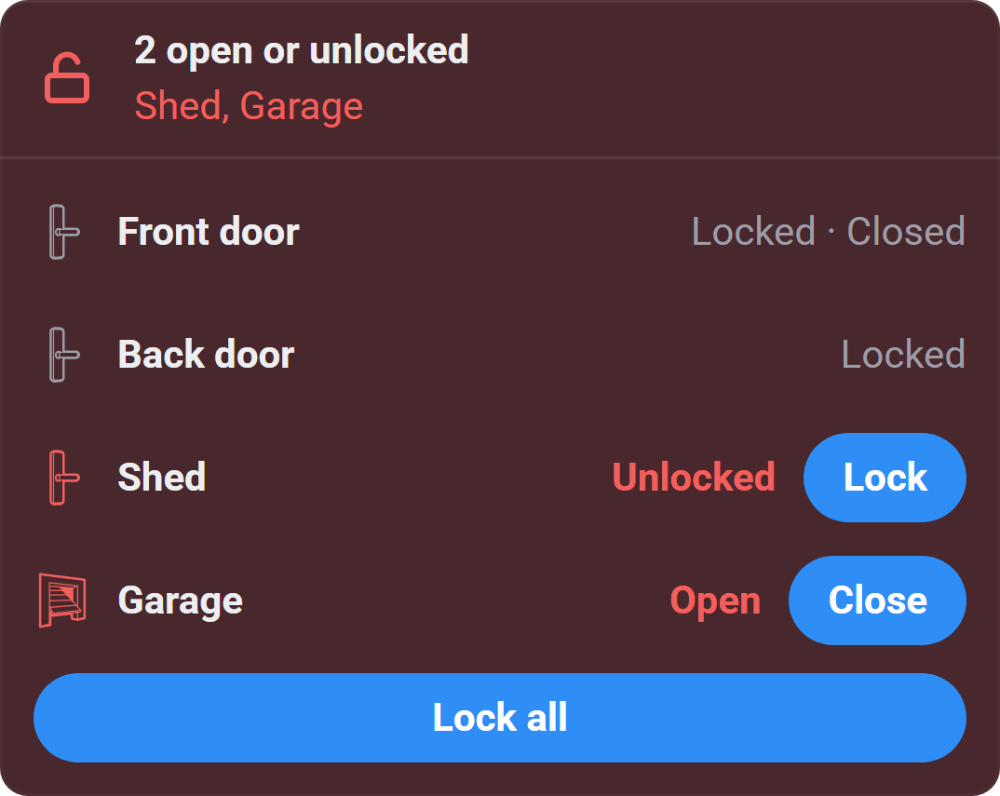

Locks, doors, windows and garage doors in one line: *All locked and closed*, or what isn't, on a red tile. Tap it for the list, with **Lock** and **Close** buttons.

**Settings:** devices, one line or the full list, allow unlocking.

## Curtains
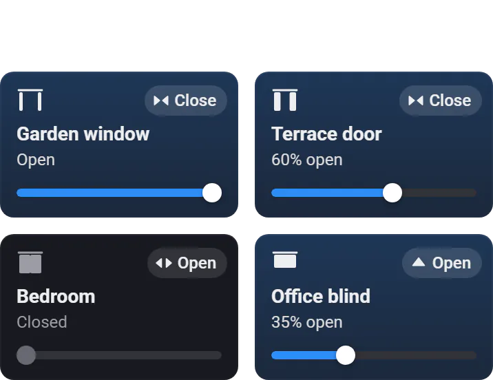

Curtains and blinds as tiles: tap to open or close (the corner label says which), or use the slider for anything between. A tap while it moves sends it back.

**Settings:** devices, what a tap does halfway, inverted position, state line, group by room.

## Media
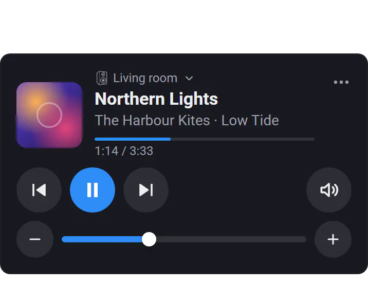

One speaker as a card: album art, the track, play controls, mute, and a volume that moves on every tap but never overshoots or passes your maximum. Shows TV and line-in instead of old album art. Tap the name to switch speaker. Up to four buttons behind ⋯ run the speaker's own actions (such as *Set source to TV*) or flows; they need an [API key](#api-key).

**Settings:** speaker, speaker switching, volume as a bar or buttons, volume step and maximum, progress, shuffle and repeat, four buttons with an icon and a name.

## Smart Stack
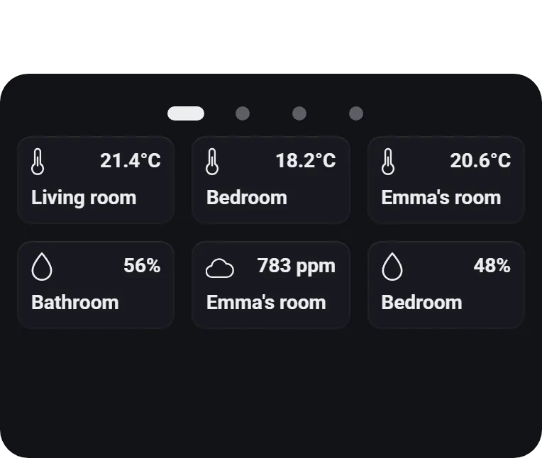

Widgetkeeper widgets from another dashboard, one at a time in the space of one. It turns every 30 seconds, and swipes or the dots move it by hand. Smart rotate brings a widget forward while something happens on it: music plays, a timer runs, a camera sees someone, a door is open. A Flow card can bring one forward too. Needs an [API key](#api-key) to read the dashboard.

**Settings:** dashboard, interval, smart rotate, pause after a swipe, dots.

## Dashboard examples
**Home**

**Energy**
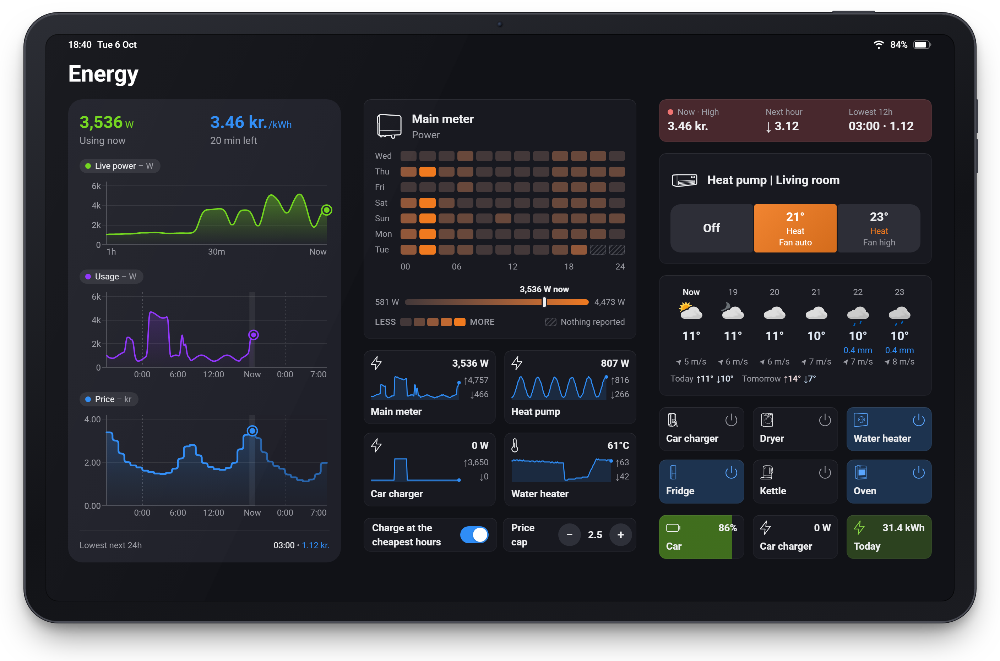

**Security**
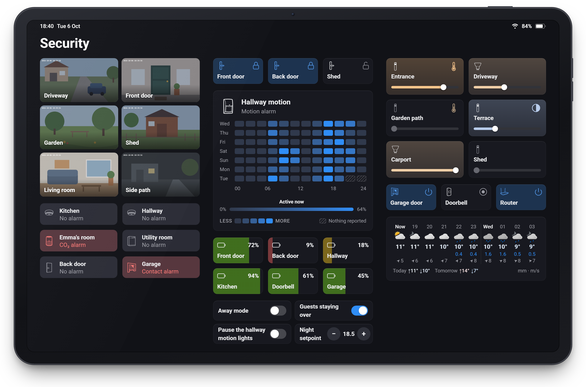

**Climate**
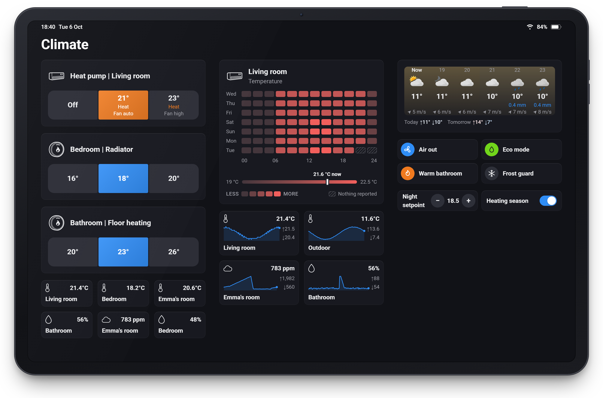

**Evening**
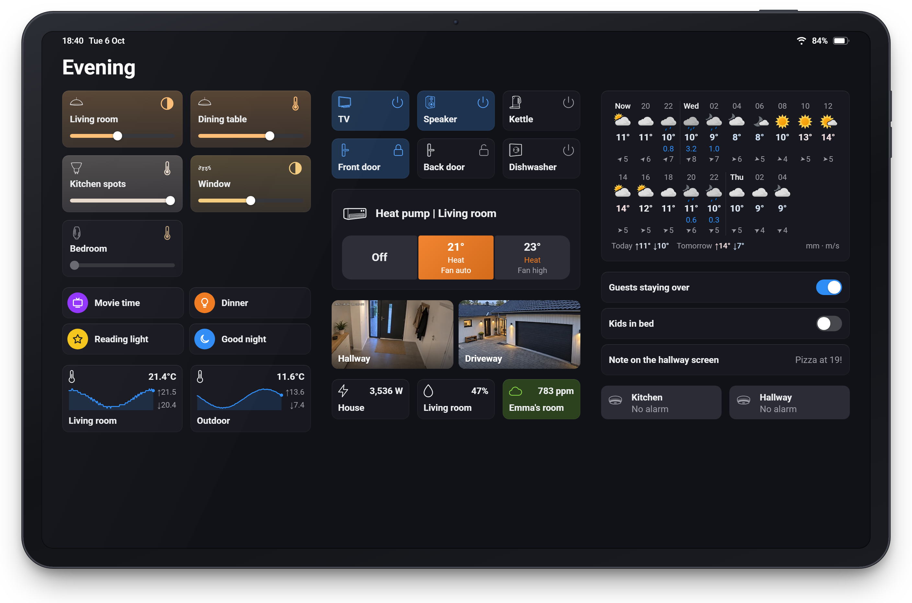

**Garden**
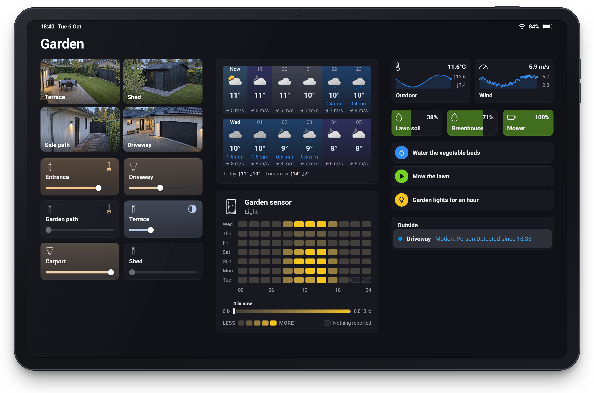

**Kitchen**
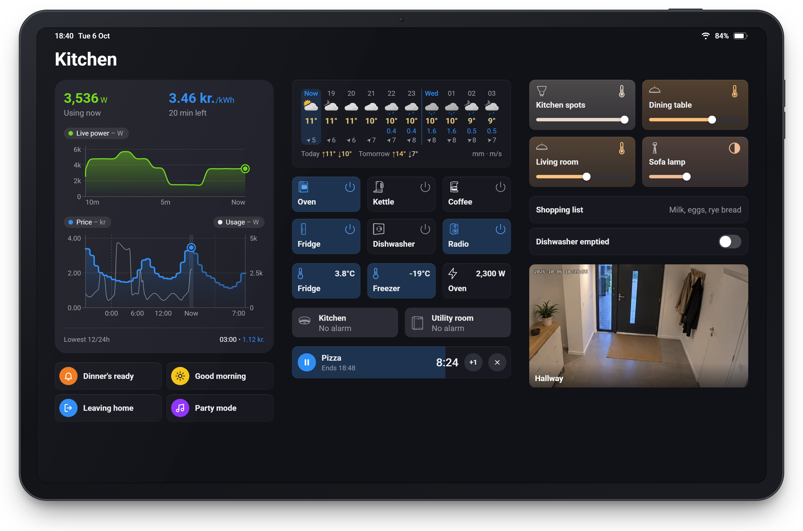

## API key
Homey doesn't let apps change variables, start flows or read dashboards on their own, so Flow Variables, Flow Buttons, Media's buttons and Smart Stack need a Homey API key. Create one in the Homey web app under **Settings → API Keys** with those permissions, and paste it under **Apps → Widgetkeeper → Configure**. The key stays on your Homey.

## Languages
English, Dutch, German, French, Italian, Swedish, Norwegian, Spanish, Danish, Russian, Polish, Korean and Arabic, following Homey's language.

## Installation
Install Widgetkeeper from the [Homey App Store](https://homey.app/a/com.thomassidor.widgetkeeper/). The [test version](https://homey.app/a/com.thomassidor.widgetkeeper/test/) has the next version's widgets before they go live. To install it from source with the Homey CLI, see [CONTRIBUTING.md](CONTRIBUTING.md).

## Troubleshooting
If a widget doesn't work as expected, open **Apps → Widgetkeeper → Configure** in the Homey app and pick the device. Include that report when you [open an issue](https://github.com/thomassidor/widgetkeeper/issues).

## Changelog
See [CHANGELOG.md](CHANGELOG.md).

## License
[MIT](LICENSE)
