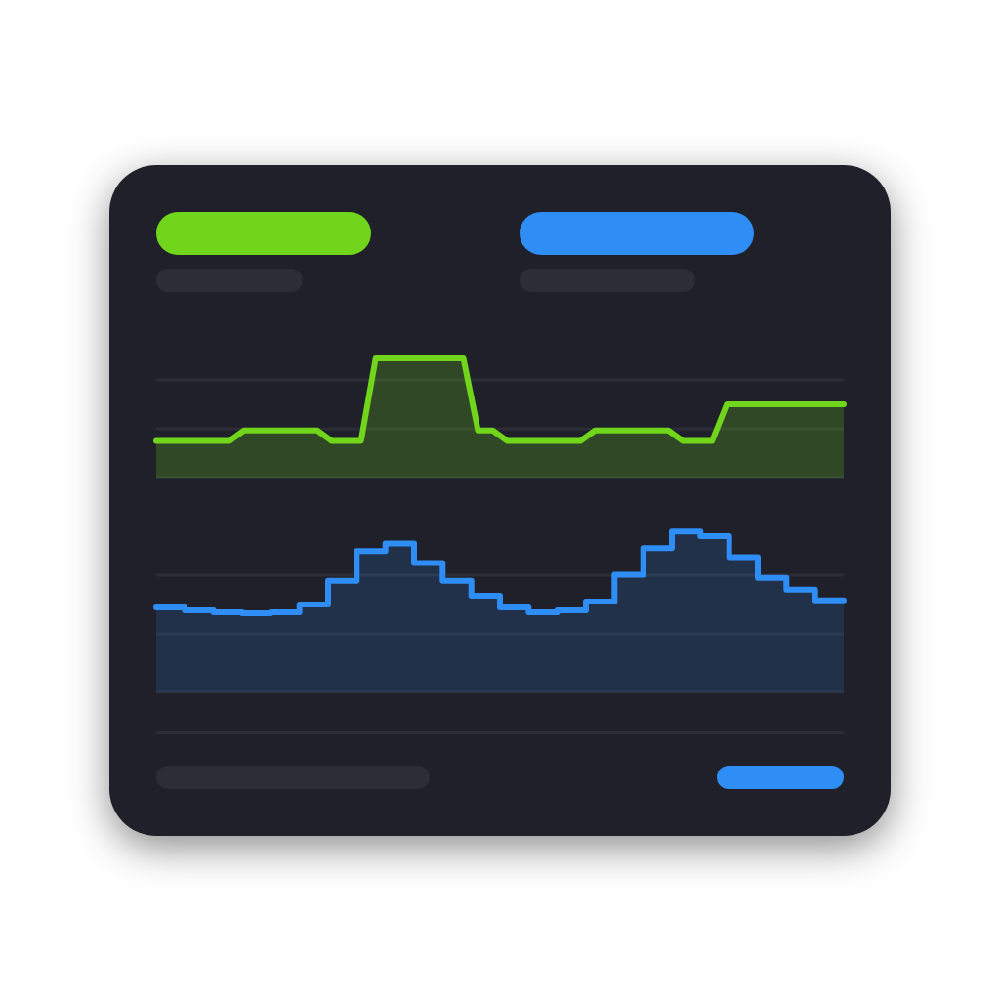

# Widgetkeeper

Custom dashboard widgets for Homey Pro (`com.thomassidor.widgetkeeper`).

## Widgets

### Electricity


One card with:
- live power for a configurable window (30 s to 1 h)
- the hourly electricity price from 24 h back to 12 h ahead
- a usage trace for the last 24 h
- the cheapest hour in the next 12 and/or 24 h

Hover or drag over either chart to scrub.

- **Meter**: pick any device with `measure_power` in the widget's device setting.
- **Prices**: Homey Energy dynamic electricity prices. Enable them under Homey Energy (Homey Pro ≥ 12.6). The widget shows the price Homey returns. Whether your own tariffs and fees from Homey Energy's price settings are included depends on Homey.
- **Settings**: *Live power window*, *Show usage history* (optionally as a separate chart), *Show lowest price* (off / next 12 h / next 24 h / both).

### Thermostat shortcuts


Three preset buttons for one thermostat or aircon. Each button can set the power (keep / on / off), the target temperature, the mode, and one extra setting such as the fan speed. The button that matches the device's current state is highlighted.

## Diagnostics
The app settings page (Homey app → Apps → Widgetkeeper → Configure) shows the app's recent log lines. You can also pick a device there to see its capability details.

## Development

```sh
npm install
npx homey app validate --level debug   # compile + validate
npx homey app run                      # run on your Homey (needs Docker); widget files hot-reload
npx homey app install                  # install permanently
npm run placeholders                   # regenerate placeholder PNGs
```

This uses the project-local Homey CLI (`npx homey`, v4). Code is TypeScript (ESM), compiled to `.homeybuild/`. The widget front-end (`widgets/*/public`) is plain JS, because Homey serves those files as-is.

`dev/preview.html` and `dev/thermostat-preview.html` render the widgets with mock data, outside Homey. To view them, serve the repo root, e.g. `python -m http.server`, and open `/dev/preview.html`. Add `#live=0.4` or `#price=0.3` to simulate scrubbing.

### Layout
```
app.ts                          App: owns the services, registers autocomplete listeners
api.ts                          App API (diagnostics for the settings page)
lib/ElectricityService.ts       live buffer, insights usage, Homey Energy prices
lib/ThermostatService.ts        thermostat state tracking and preset apply
lib/appApi.ts                   shared HomeyAPI instance
lib/Diagnostics.ts              in-memory log buffer
lib/series.ts                   resampling / parsing helpers
widgets/electricity/            widget manifest, api.ts, public/ (renderer)
widgets/thermostat/             widget manifest, api.ts, public/ (renderer)
settings/                       app settings page (diagnostics)
dev/                            browser previews with mock data
scripts/                        placeholder artwork and preview image generators
```

## License
[MIT](LICENSE)
