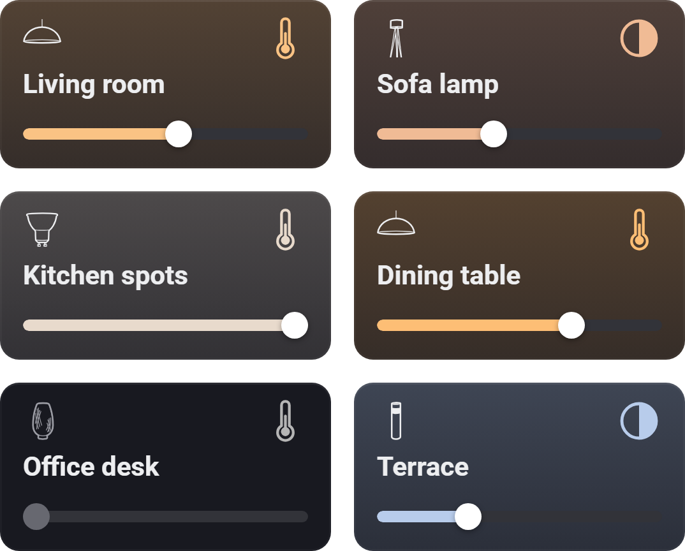

# Widgetkeeper

Extra dashboard widgets for Homey Pro, made to sit naturally next to Homey's own with the same look and feel.

<a href="#electricity-overview"><picture><source media="(prefers-color-scheme: dark)" srcset="docs/previews/electricity-dark.png"></picture></a>
<a href="#electricity-overview"><b>Electricity Overview</b></a> 
Live power use, hourly electricity prices and usage history on one card 

<a href="#thermostat-shortcuts"><picture><source media="(prefers-color-scheme: dark)" srcset="docs/previews/thermostat-dark.png"></picture></a>
<a href="#thermostat-shortcuts"><b>Thermostat Shortcuts</b></a> 
Three one-tap presets for a thermostat, heat pump or air conditioner 

<a href="#device-quick-actions"><picture><source media="(prefers-color-scheme: dark)" srcset="docs/previews/quickactions-dark.png"></picture></a>
<a href="#device-quick-actions"><b>Device Quick Actions</b></a> 
Compact tiles that run a device's quick action with one tap 

<a href="#sensor-alarms"><picture><source media="(prefers-color-scheme: dark)" srcset="docs/previews/sensoralarms-dark.png"></picture></a>
<a href="#sensor-alarms"><b>Sensor Alarms</b></a> 
Tiles that show a sensor's alarm and turn red when one is on 

<a href="#weather-forecast"><picture><source media="(prefers-color-scheme: dark)" srcset="docs/previews/weather-dark.png"></picture></a>
<a href="#weather-forecast"><b>Weather Forecast</b></a> 
The next 36 hours, hour by hour, from MET Norway (yr.no) 

<a href="#insights-heatmap"><picture><source media="(prefers-color-scheme: dark)" srcset="docs/previews/heatmap-dark.png"></picture></a>
<a href="#insights-heatmap"><b>Insights Heatmap</b></a> 
A week of one value (light, temperature, motion …) as a grid of weekdays and hours 

<a href="#cameras"><picture><source media="(prefers-color-scheme: dark)" srcset="docs/previews/cameras-dark.png"></picture></a>
<a href="#cameras"><b>Cameras</b></a> 
Two to six cameras in one grid of snapshots; tap one to watch it live 

<a href="#device-values"><picture><source media="(prefers-color-scheme: dark)" srcset="docs/previews/values-dark.png"></picture></a>
<a href="#device-values"><b>Device Values</b></a> 
Compact tiles that each show one value, such as a temperature, power or on/off 

<a href="#light-controls"><picture><source media="(prefers-color-scheme: dark)" srcset="docs/previews/lights-dark.png"></picture></a>
<a href="#light-controls"><b>Light Controls</b></a> 
Compact light tiles with brightness, colour and colour temperature: six lights in the space of three 

<a href="#sparklines"><picture><source media="(prefers-color-scheme: dark)" srcset="docs/previews/sparklines-dark.png"></picture></a>
<a href="#sparklines"><b>Sparklines</b></a> 
Tiles with a small chart of a value over the last hour, day or week, with its lowest and highest 

## Electricity Overview

Live power use (30 seconds to 1 hour), the hourly price from yesterday to 12 hours ahead, the last 24 hours of usage and the cheapest upcoming hour. Tap a chart, or hover with a mouse, to see the value at that moment.

Needs a device that reports power and dynamic prices switched on in Homey Energy (Homey Pro 12.6 or later).

**Settings:** power meter, live power window, usage history (on the price chart or separate, neutral or purple), smooth lines, lowest price in the next 12 h, 24 h or both.

## Thermostat Shortcuts

Three one-tap presets for a thermostat, heat pump or air conditioner, such as *Off*, *Heat 21°* and *Heat 24° · Fan level 5*. Each sets on/off, the target temperature, the mode and one extra option such as the fan speed. The matching preset lights up; otherwise the widget shows the device's current state.

## Device Quick Actions

Half-height tiles that run a device's quick action with one tap, the same as the round button on Homey's own tile: on/off, lock/unlock, play/pause or a button press. A tile is highlighted while the device is on, locked or playing.

**Settings:** devices, active style (blue tint or lighter tile).

## Sensor Alarms

Tiles in the style of Homey's temperature tiles that show *No alarm*, the alarm that's on (such as *Smoke alarm*) or the number of alarms, and turn red while one is on. Every alarm counts, including those added by apps, such as radon.

**Settings:** sensors, count motion and contact as alarms (off by default).

## Weather Forecast

The next 36 hours for your Homey's location from [MET Norway](https://www.met.no/en) ([yr.no](https://www.yr.no)): icon, temperature, precipitation and wind for each hour, with today's and tomorrow's high and low underneath. Swipe sideways to see further ahead.

**Settings:** compact or detailed columns, one or two rows, every 1, 2 or 3 hours, colour theme.

Weather data from MET Norway, licensed under [CC BY 4.0](https://creativecommons.org/licenses/by/4.0/). Icons: [Yr's weather symbols](https://github.com/metno/weathericons) (MIT).

## Insights Heatmap

A week of one Insights value as a grid of weekdays and hours, with a scale and a marker at the current value. Works with numbers (light, temperature, power …) and on/off values (motion, contact …), shown as the share of each hour they were on. On/off history fills in over the first days, as Insights keeps only their last 50 changes.

**Settings:** device and value, this week or the last 3–14 days, 1–3 hours per column, show scale, show legend.

## Cameras

Your cameras in a grid of snapshots that refresh every few seconds. Tap one to watch it live through Homey's own live view; tap again to go back.

**Settings:** cameras, refresh interval (5 s to 1 min).

## Device Values

Half-height tiles that each show one device value, such as a temperature, a battery level or on/off, updated live. Percentages can fill their tile in red, yellow or green.

**Settings:** up to six values, 3 or 2 columns, fill percentages by level with adjustable limits.

## Light Controls

Compact light tiles, six in the space of three of Homey's light cards. Tap a tile to turn the light on or off, drag or tap the bar to set the brightness, and tap the colour button (a half-filled circle, or a thermometer on white-only lights, in the light's colour) to pick a colour or a white from a row of swatches. On Android, tap the bar instead of dragging. Lights in the same room can share one tile that controls them all. Plugs and switches that only turn on and off get a tile without the bar.

**Settings:** lights, colour palette (bright colours, warm from red to cool white, or dusk), group by room.

## Sparklines

Device Values' tiles with a small chart of each value from Insights, with its highest and lowest, following the live value.

**Settings:** up to six values, time span (1 h, 6 h, 24 h or 7 days), 2 or 1 columns.

## Languages
English, Dutch, German, French, Italian, Swedish, Norwegian, Spanish, Danish, Russian, Polish, Korean and Arabic, following Homey's language.

## Installation
Widgetkeeper isn't in the Homey App Store yet. Install it from source with the Homey CLI; see [CONTRIBUTING.md](CONTRIBUTING.md).

## Troubleshooting
If a widget doesn't work as expected, open **Apps → Widgetkeeper → Configure** in the Homey app and pick the device. Include that report when you [open an issue](https://github.com/thomassidor/widgetkeeper/issues).

## Changelog
See [CHANGELOG.md](CHANGELOG.md).

## License
[MIT](LICENSE)
