# Widgetkeeper

Extra dashboard widgets for Homey Pro.

I built these to replace a few native Homey widgets that didn't quite behave the way I wanted. The aim is widgets that sit naturally next to Homey's own: the same look, the same feel, and no sense that they came from somewhere else.

<a href="#electricity-overview"><picture><source media="(prefers-color-scheme: dark)" srcset="docs/previews/electricity-dark.png">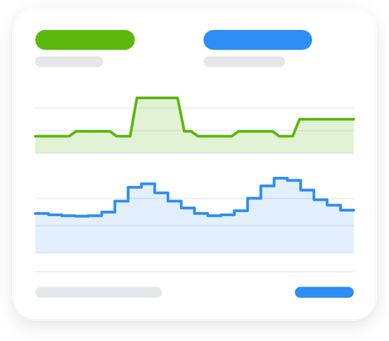</picture></a>
<a href="#electricity-overview"><b>Electricity Overview</b></a> 
Live power use, hourly electricity prices and usage history on one card 

<a href="#thermostat-shortcuts"><picture><source media="(prefers-color-scheme: dark)" srcset="docs/previews/thermostat-dark.png">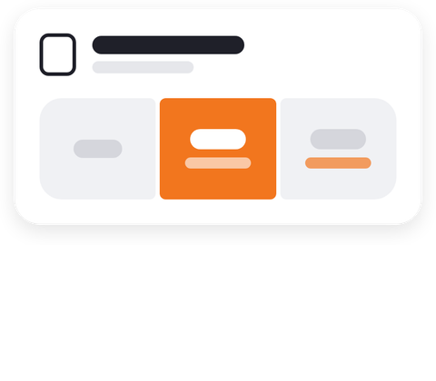</picture></a>
<a href="#thermostat-shortcuts"><b>Thermostat Shortcuts</b></a> 
Three one-tap presets for a thermostat, heat pump or air conditioner 

<a href="#device-quick-actions"><picture><source media="(prefers-color-scheme: dark)" srcset="docs/previews/quickactions-dark.png">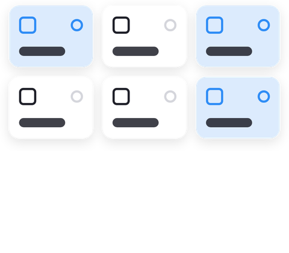</picture></a>
<a href="#device-quick-actions"><b>Device Quick Actions</b></a> 
Compact tiles that run a device's quick action with one tap 

<a href="#sensor-alarms"><picture><source media="(prefers-color-scheme: dark)" srcset="docs/previews/sensoralarms-dark.png">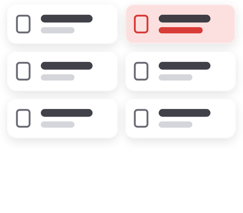</picture></a>
<a href="#sensor-alarms"><b>Sensor Alarms</b></a> 
Tiles that show a sensor's alarm and turn red when one is on 

<a href="#weather-forecast"><picture><source media="(prefers-color-scheme: dark)" srcset="docs/previews/weather-dark.png">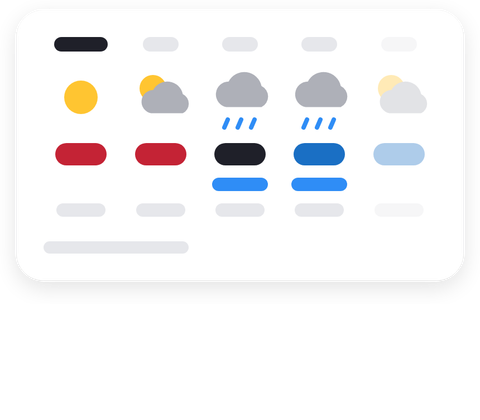</picture></a>
<a href="#weather-forecast"><b>Weather Forecast</b></a> 
The next 36 hours, hour by hour, from MET Norway (yr.no) 

<a href="#insights-heatmap"><picture><source media="(prefers-color-scheme: dark)" srcset="docs/previews/heatmap-dark.png">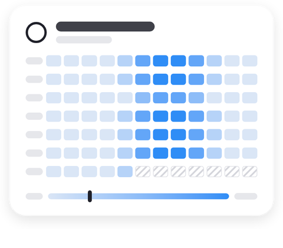</picture></a>
<a href="#insights-heatmap"><b>Insights Heatmap</b></a> 
A week of one value (light, temperature, motion …) as a grid of weekdays and hours 

<a href="#cameras"><picture><source media="(prefers-color-scheme: dark)" srcset="docs/previews/cameras-dark.png">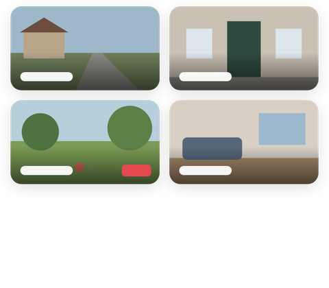</picture></a>
<a href="#cameras"><b>Cameras</b></a> 
Two to six cameras in one grid of snapshots; tap one to watch it live 

## Electricity Overview
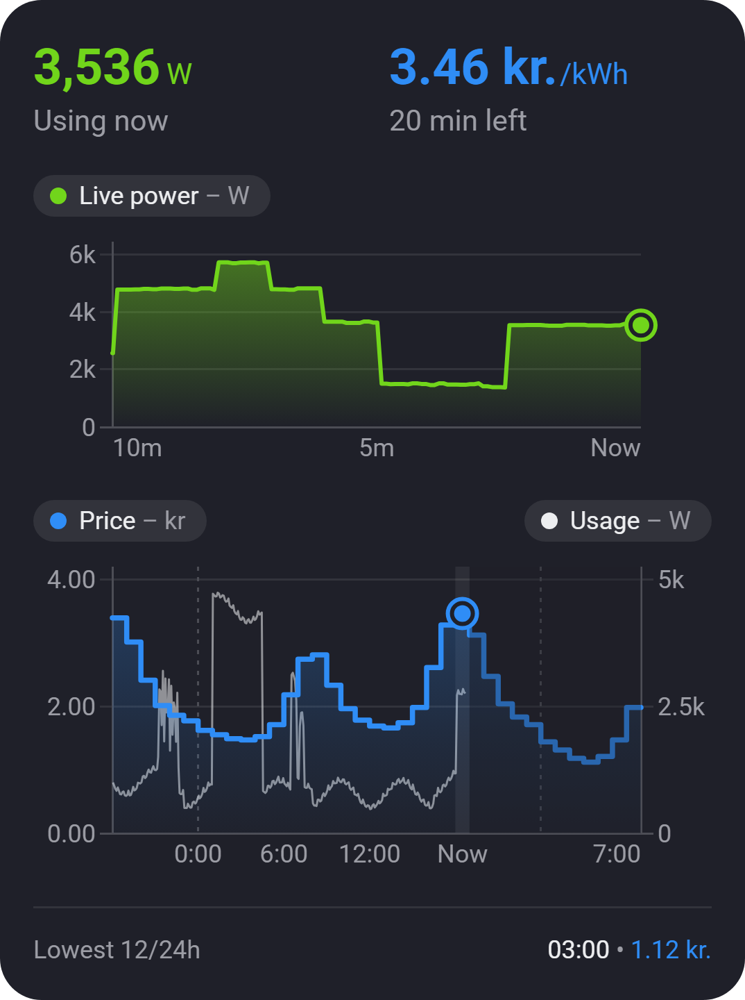

Your power use and electricity price together on one card:
- **Live power**, updated every few seconds, over the last 30 seconds to 1 hour.
- **Hourly electricity price**, from yesterday to 12 hours ahead, with midnight marked.
- **Usage history** for the last 24 hours, drawn on the price chart or as its own chart.
- **Cheapest upcoming hour** in the next 12 hours, the next 24 hours, or both.

Tap or drag on a chart (or hover with a mouse) to see the exact value at any moment. On Android, Homey's dashboard takes over drags, so tap instead; the value stays for 3 seconds.

**What you need**
- A power meter in Homey, such as a P1 meter or an energy-monitoring smart plug. Any device that reports power will work.
- Dynamic electricity prices switched on in **Homey Energy**. This needs Homey Pro 12.6 or later. The widget shows the price Homey provides. Whether your own fees and tariffs are included depends on your Homey Energy price settings.

**Settings**
| Setting | Options |
| --- | --- |
| Power meter | Any device that reports power |
| Live power window | 30 seconds, 1, 5, 10 or 30 minutes, or 1 hour |
| Show usage history | On / off, and optionally as a separate chart |
| Usage history colour | **Neutral** (the default: white in dark mode, black in light mode) or Homey's **Purple** |
| Smooth chart lines | On / off: softer live and usage lines and rounded price steps |
| Show lowest price | Off, next 12 hours, next 24 hours, or both |

## Thermostat Shortcuts
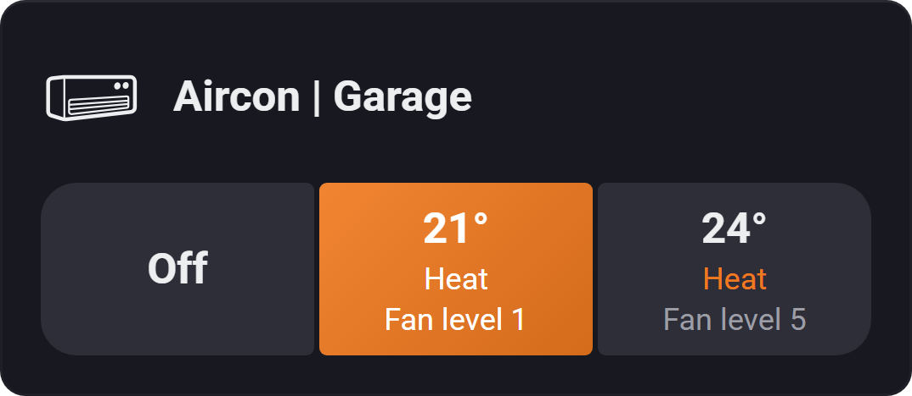

Three one-tap presets for a thermostat, heat pump or air conditioner. For example: *Off*, *Heat 21° · Fan level 1* and *Heat 24° · Fan level 5*.

Each button can:
- turn the device on or off, or leave it as it is
- set the target temperature
- set the mode, such as heat, cool or auto
- set one extra option, such as the fan speed

The button that matches the device's current state lights up. When no preset matches, the widget shows what the device is doing right now.

**Setting it up**
1. Add the widget to a dashboard and pick your thermostat or aircon.
2. Configure each button. The temperature, mode and extra lists show only what your device supports. Pick the device first, then reopen these settings.

## Device Quick Actions
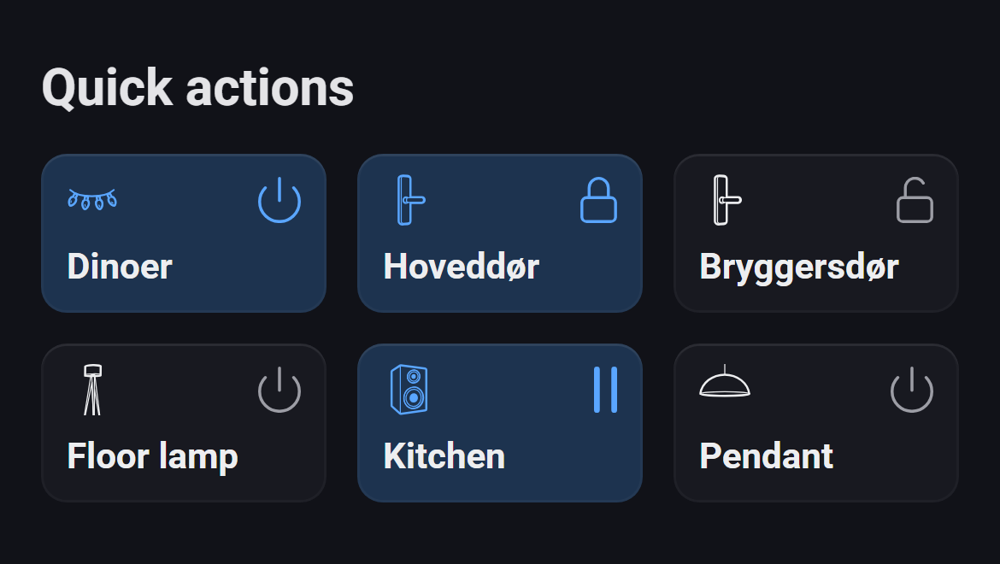

Half-height device tiles for as many devices as you like. Tap anywhere on a tile to run the device's quick action, the same action as the round button on Homey's own device tile:
- turn a light, plug or other device on or off
- lock or unlock a door
- play or pause a speaker
- press a button, such as a scene or alarm button

The whole tile shows the state: it's highlighted while the device is on, locked or playing. The tiles use the same icons as Homey's own tiles, including icons you picked for a device.

**Setting it up**
1. Add the widget to a dashboard and pick the devices. They're shown in the order you pick them.
2. Optionally pick the active tile style: **Blue tint** (the default) or **Lighter tile**.

The quick action is the one Homey uses for the device, including one you changed in the device's settings. Devices without a quick action, such as sensors, are shown dimmed. The tiles don't react while the dashboard is in edit mode.

## Sensor Alarms
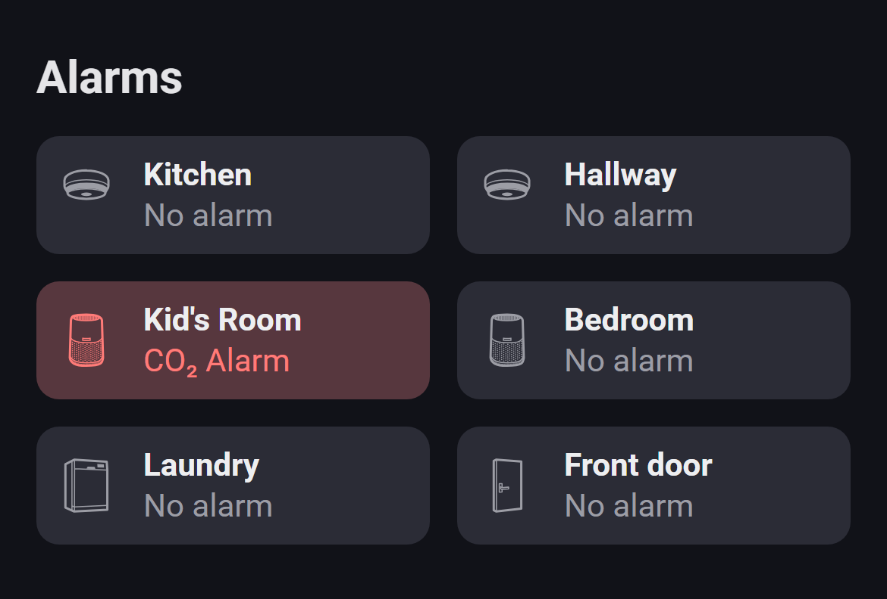

Tiles for as many sensors as you like, two per row, in the style of Homey's own temperature tiles. Each tile shows the device icon, its name and its alarm:
- *No alarm* when everything is fine
- the alarm that's on, such as *Smoke alarm*, *Water alarm* or *CO₂ Alarm*
- the number of alarms when several are on

The tile turns red while an alarm is on, and updates the moment it goes on or off. Every alarm a device has counts, including those added by apps, such as an air quality monitor's radon or VOC alarm.

**Setting it up**
1. Add the widget to a dashboard and pick the sensors. They're shown in the order you pick them.
2. Optionally switch on **Count motion and contact as alarms**. It's off by default, so an open door, detected motion or a camera spotting a person doesn't turn a tile red.

## Weather Forecast
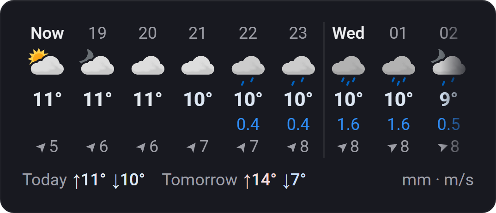

The next 36 hours for your Homey's location, hour by hour, from [MET Norway](https://www.met.no/en), the forecast behind [yr.no](https://www.yr.no). Each hour shows:
- the weather icon
- the temperature, blue when it's cold, plain around 12° and red when it's hot
- the precipitation in mm, when there is any
- the wind speed in m/s, with an arrow showing which way it blows

Swipe the hours sideways to see further ahead. A thin line marks each new day. Underneath, the highest and lowest temperature for the rest of today and for tomorrow. On a phone, compact columns show 9 hours at a time, or 18 with two rows; wider widgets show more.

**Settings**
| Setting | Options |
| --- | --- |
| Hour columns | **Compact** (the default: more hours, with the units shown once) or **Detailed** (larger, with units on every value) |
| Rows | **One row**, or **Two rows**, which swipe a page at a time |
| Interval | **Every hour**, or every **2** or **3 hours**. A combined column shows the average temperature and wind and the total precipitation for those hours, with the icon of the wettest one. |
| Colours | **Standard** (the default), **Vivid** (every temperature in colour, blue → gold → red, and the current hour highlighted), **Tinted by temperature** (each hour's column shaded by its temperature), **Tinted by sky** (each column shaded by its weather: gold sun, slate clouds, blue rain, indigo night …) or **Weather background** (the whole widget on a gradient for the weather right now, with white text) |

The forecast needs no other setup: the widget uses the location set for your Homey (Homey app → Settings → Location).

The forecast is shared by all weather widgets and only fetched while one is on screen, at most as often as MET Norway updates it. Weather data from MET Norway is licensed under [CC BY 4.0](https://creativecommons.org/licenses/by/4.0/). The weather icons are [Yr's weather symbols](https://github.com/metno/weathericons) (MIT).

## Insights Heatmap
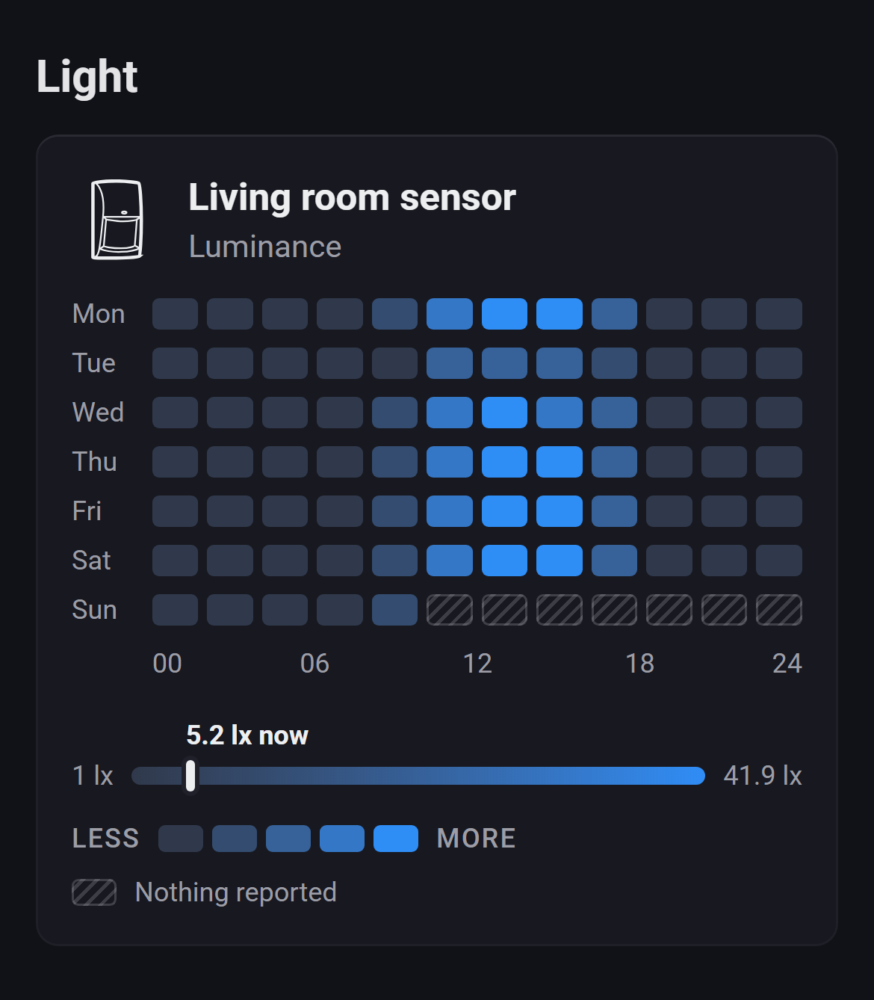

A week of one device value as a grid: a row per weekday and a column per 1, 2 or 3 hours, shaded from the lowest to the highest value shown. Under it, a scale from the lowest to the highest value with a marker at the current one. Hours with nothing reported are hatched, such as the rest of today.

It works with any number Homey logs in Insights, such as light, temperature, power or CO₂, and with on/off values such as motion, a door contact or a light being on. For those, each cell is the share of the hour they were on, and the scale starts at 0 %.

**Settings**
| Setting | Options |
| --- | --- |
| Device | Any device with a value logged in Insights |
| Value | Any of the device's numbers or on/off values in Insights. Pick the device first, then reopen the settings. |
| Days | **This week (Mon–Sun)** (the default), or the last **3**, **7**, **10** or **14 days**. With more than 7 days, each row also shows the date. |
| Hours per column | **1**, **2** (the default) or **3** |
| Show scale | On (the default) / off |
| Show legend | On (the default) / off |

On/off values fill in over the first days. Homey's Insights only keep the last 50 changes of an on/off value, which for a busy motion sensor is less than a day. So the app records them itself from the moment the widget first loads, and keeps up to 14 days of them, until 8 days after the widget was last shown. Numbers come straight from Insights and show the whole week right away.

## Cameras
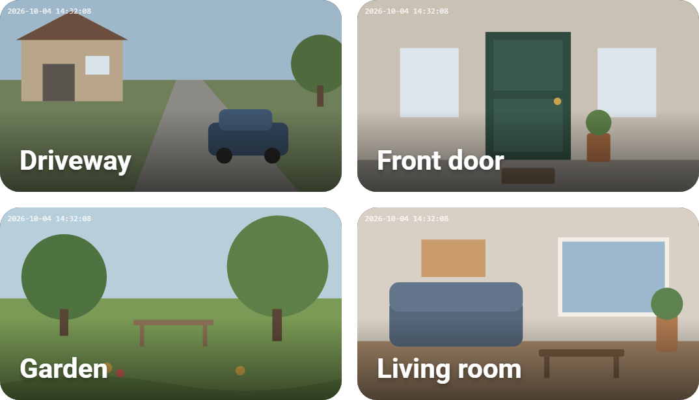

Your cameras in one grid of snapshots, two per row, each with its name. With an odd number of cameras, the last one spans the full width. The snapshots refresh every few seconds while the dashboard is open, and pause while it's in the background. A snapshot that stops refreshing shows the time it was taken.

Tap a camera to watch it live: it fills the whole widget, with a red **Live** label. Tap it again to go back to the snapshot. Live view ends on its own after 5 minutes, or when the camera stops sending video. It uses Homey's own live view, so it works for cameras that Homey can play live itself.

**Settings**
| Setting | Options |
| --- | --- |
| Cameras | Any cameras and doorbells, shown in the order you pick them |
| Refresh snapshots every | **5 s**, **10 s** (the default), **30 s** or **1 min** |

## Languages
English, Dutch, German, French, Italian, Swedish, Norwegian, Spanish, Danish, Russian, Polish, Korean and Arabic. The widgets follow Homey's language.

## Installation
Widgetkeeper isn't in the Homey App Store yet. For now you can install it from source with the Homey CLI. See [CONTRIBUTING.md](CONTRIBUTING.md).

## Troubleshooting
- **"Select a power meter" / "Select a thermostat" / "Select devices"**: open the widget's settings and pick a device.
- **"Set Homey's location to see the forecast"**: set your Homey's location in the Homey app, under **Settings → Location**.
- **"No electricity prices available"**: switch on dynamic prices in Homey Energy.
- **A thermostat preset or quick action doesn't apply**: open the Homey app, go to **Apps → Widgetkeeper → Configure**, and pick the device. The page shows recent log lines and your device's capabilities. Include that report when you [open an issue](https://github.com/thomassidor/widgetkeeper/issues).

## Changelog
See [CHANGELOG.md](CHANGELOG.md) for what's new in each version.

## License
[MIT](LICENSE)

The screenshots show the real widgets with mock data, rendered by `npm run screenshots`. The small images in the overview are the widgets' previews from Homey's widget picker, cropped to the card.
